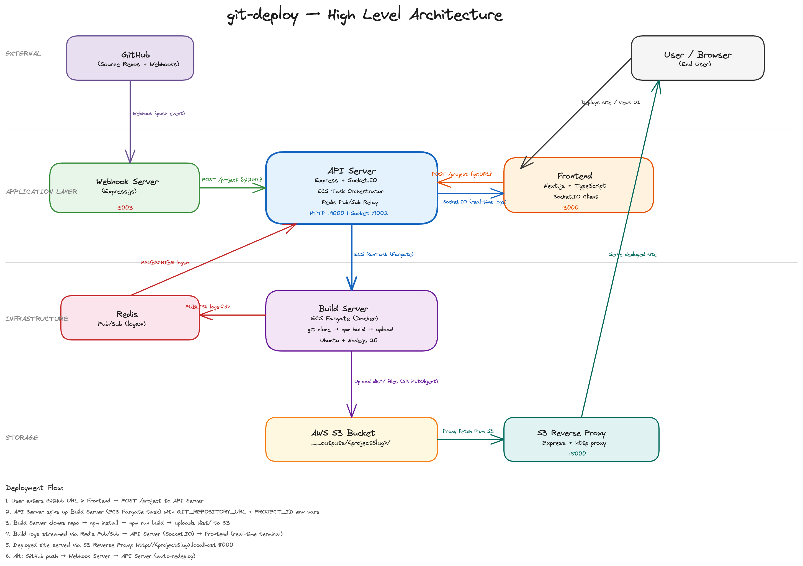

# git-deploy

A **Vercel-like** deployment platform that takes a GitHub repository URL, builds it inside an isolated container, uploads the static output to AWS S3, and serves it through a reverse proxy — all with real-time build logs streamed to the browser.

## System Design



---

## Table of Contents

- [Architecture Overview](#architecture-overview)
- [How It Works](#how-it-works)
- [Tech Stack](#tech-stack)
- [Project Structure](#project-structure)
- [Components](#components)
- [Data Flow](#data-flow)
- [Getting Started](#getting-started)
  - [Prerequisites](#prerequisites)
  - [Environment Variables](#environment-variables)
  - [Installation](#installation)
  - [Running the Services](#running-the-services)
- [API Reference](#api-reference)
- [Deployment Flow Diagram](#deployment-flow-diagram)
- [Assumptions and Limitations](#assumptions-and-limitations)

---

## Architecture Overview

The system is composed of **5 independent services** that communicate through HTTP, Socket.IO, Redis Pub/Sub, and AWS APIs:

```
                          ┌─────────────┐
                          │   GitHub    │
                          │  (push event│
                          └──────┬──────┘
                                 │ webhook
                                 ▼
                          ┌─────────────┐
                          │   Webhook   │ :3003
                          │   Server    │
                          └──────┬──────┘
                                 │ POST /project
                                 ▼
┌──────────┐  POST /project  ┌─────────────┐  RunTask (Fargate)  ┌──────────────┐
│ Frontend │────────────────▶│ API Server  │────────────────────▶│ Build Server │
│ (Next.js)│                 │  (Express)  │                      │  (Docker)    │
│  :3000   │◀──Socket.IO────│  :9000      │                      │  (ECS Task)  │
└──────────┘                 │ Socket.IO   │                      └──────┬───────┘
                             │ :9002       │         Redis Pub/Sub       │
                             └─────────────┘◀───────────────────────────▶│
                                                                     uploads
                                                                       │
                                                                       ▼
                                                              ┌──────────────┐
                                                              │  AWS S3      │
                                                              │ (__outputs/) │
                                                              └──────┬───────┘
                                                                     │
                                                                     ▼
                                                              ┌──────────────┐
                                                              │S3 Reverse    │
                                                              │Proxy :8000   │── serves static files
                                                              └──────────────┘
```

> A high-level architecture diagram is available at [`hld-diagram.excalidraw`](./hld-diagram.excalidraw). Open it at [excalidraw.com](https://excalidraw.com).

---

## How It Works

1. A user pastes a **GitHub repository URL** into the frontend UI and clicks **Deploy**
2. The frontend sends a `POST /project` request to the **API Server**
3. The API Server generates a unique **project slug** from the GitHub URL and spins up an **AWS ECS Fargate task** (the Build Server container)
4. The Build Server **clones the repo**, runs `npm install && npm run build`, and **uploads the `dist/` output to S3**
5. During the build, **logs are streamed in real-time** via Redis Pub/Sub → Socket.IO → the browser
6. Once deployed, the site is served at `http://<projectSlug>.localhost:8000` through the **S3 Reverse Proxy**

There is also a **Webhook Server** that listens for GitHub push events on the `main` branch and automatically triggers a redeployment.

---

## Tech Stack

| Layer | Technology |
|---|---|
| **Frontend** | Next.js 14, TypeScript, Tailwind CSS, Socket.IO Client |
| **API Server** | Express.js, Socket.IO, ioredis, AWS SDK (ECS) |
| **Build Server** | Docker (Ubuntu + Node.js 20), AWS SDK (S3), ioredis |
| **Webhook Server** | Express.js, crypto (HMAC-SHA1 verification) |
| **Reverse Proxy** | Express.js, http-proxy |
| **Infrastructure** | AWS ECS Fargate, AWS S3, Redis |
| **Real-time Communication** | Redis Pub/Sub, Socket.IO |

---

## Project Structure

```
git-deploy/
├── api-server/            # Express + Socket.IO API server
│   ├── index.js           # Main server: POST /project, Socket.IO relay, Redis subscriber
│   ├── package.json
│   └── package-lock.json
├── build-server/          # Ephemeral Docker container (runs on ECS Fargate)
│   ├── Dockerfile         # Ubuntu + Node.js 20 image
│   ├── main.sh            # Entry point: clones the git repo
│   ├── script.js          # Runs build, streams logs, uploads to S3
│   ├── package.json
│   └── package-lock.json
├── frontend/              # Next.js 14 web UI
│   ├── app/
│   │   ├── page.tsx       # Main page: URL input, deploy button, live logs
│   │   ├── layout.tsx     # Root layout (dark theme)
│   │   └── globals.css    # Tailwind + shadcn/ui CSS variables
│   ├── components/
│   │   └── ui/            # shadcn/ui components (Button, Input)
│   ├── lib/
│   │   └── utils.ts       # cn() utility for className merging
│   ├── package.json
│   ├── tailwind.config.ts
│   ├── tsconfig.json
│   └── ...
├── s3-reverse-proxy/      # Serves deployed sites from S3
│   ├── index.js           # Reverse proxy: subdomain → S3 path mapping
│   ├── package.json
│   └── package-lock.json
├── webhook/               # GitHub webhook listener
│   ├── index.js           # Verifies signature, triggers redeploy on push to main
│   ├── package.json
│   └── package-lock.json
├── hld-diagram.excalidraw # Architecture diagram (open at excalidraw.com)
└── .gitignore
```

---

## Components

### 1. Frontend (`frontend/`)

A Next.js 14 single-page application that provides the deployment UI.

| Feature | Detail |
|---|---|
| **URL Input** | Accepts a GitHub repository URL with client-side validation |
| **Deploy Button** | Sends `POST /project` to the API Server |
| **Real-time Logs** | Connects to Socket.IO (`:9002`) and subscribes to `logs:<projectSlug>` channel |
| **Preview URL** | Displays a clickable link to the deployed site after deployment is queued |
| **Terminal-style UI** | Build logs rendered in green monospace text (Fira Code) with auto-scroll |

**Port**: `3000`

### 2. API Server (`api-server/`)

The central orchestrator of the system. Handles two responsibilities:

| Responsibility | Detail |
|---|---|
| **HTTP API** (`:9000`) | `POST /project` — accepts `{ gitURL, slug }`, generates a project slug, launches an ECS Fargate task, returns the project slug and preview URL |
| **Socket.IO Server** (`:9002`) | Clients join rooms by channel name. Redis pub/sub messages are relayed to the appropriate socket room in real-time |

**Slug Generation**: Extracts `username` and `repo` from the GitHub URL and formats it as `username-proj-reponame`.

### 3. Build Server (`build-server/`)

An ephemeral Docker container that runs on AWS ECS Fargate for each deployment.

**Lifecycle**:

1. `main.sh` clones the user's GitHub repo into `/home/app/output`
2. `script.js` executes `npm install && npm run build`
3. Build stdout/stderr is published to Redis channel `logs:<PROJECT_ID>`
4. After the build completes, every file in `dist/` is uploaded to S3 at `__outputs/<PROJECT_ID>/<filepath>`
5. The container exits

**Dockerfile**: Based on `ubuntu:focal` with Node.js 20 and git installed.

### 4. Webhook Server (`webhook/`)

Listens for GitHub webhook events to enable **automatic redeployment**.

| Feature | Detail |
|---|---|
| **Endpoint** | `POST /webhook` |
| **Signature Verification** | HMAC-SHA1 using a shared secret to verify the payload is from GitHub |
| **Event Filter** | Only processes `push` events to the `refs/heads/main` branch |
| **Action** | Extracts the repo URL and calls `POST http://localhost:9000/project` to trigger redeployment |

**Port**: `3003`

### 5. S3 Reverse Proxy (`s3-reverse-proxy/`)

Serves deployed static sites by mapping subdomains to S3 paths.

| Feature | Detail |
|---|---|
| **Subdomain Extraction** | Parses the hostname from incoming requests (e.g., `username-proj-reponame.localhost:8000`) |
| **S3 Proxy** | Proxies requests to `https://<bucket>.s3.amazonaws.com/__outputs/<subdomain>/<path>` |
| **Index Rewrite** | Rewrites `/` to `/index.html` so root URLs serve the index page |

**Port**: `8000`

---

## Data Flow

### Manual Deployment (via UI)

```
Frontend (:3000)                          API Server (:9000)
     │                                          │
     │  POST /project { gitURL }                │
     │─────────────────────────────────────────▶│
     │                                          │  RunTaskCommand (ECS Fargate)
     │                                          │────────────────────────▶ Build Server
     │                                          │                              │
     │  { status: "queued", projectSlug, url }  │                              │  git clone <url>
     │◀─────────────────────────────────────────│                              │  npm install
     │                                          │                              │  npm run build
     │  Socket.IO: subscribe logs:<slug>        │                              │
     │─────────────────────────────────────────▶│                              │
     │                                          │                              │
     │         Real-time build logs             │     Redis PUBLISH logs:<id>  │
     │◀─────── Socket.IO ◀──── Redis ◀─────────│◀─────────────────────────────│
     │                                          │                              │
     │                                          │                  S3 PutObject │
     │                                          │                              │─────────▶ S3
     │                                          │                              │
     │                                          │                    Container exits
     │                                          │
     │  User visits preview URL                 │
     │──────────────────▶ S3 Reverse Proxy (:8000)
     │                     │
     │                     │  Proxy fetch from S3
     │                     │─────────────────────────────────▶ AWS S3
     │                     │◀─────────────────────────────────│
     │◀───────────────────│
```

### Automatic Redeployment (via Webhook)

```
GitHub ──webhook──▶ Webhook Server (:3003) ──POST /project──▶ API Server (:9000)
                     (verifies HMAC-SHA1)                       (triggers build)
```

---

## Getting Started

### Prerequisites

- **Node.js** >= 18
- **npm** or **yarn**
- **Docker** (for building the Build Server image)
- **AWS Account** with:
  - ECS Cluster with a Fargate-compatible task definition
  - S3 Bucket for storing build outputs
  - IAM credentials with ECS and S3 permissions
- **Redis** instance (local or managed)
- **ngrok** or similar (optional, for exposing the webhook server to GitHub)

### Environment Variables

#### API Server (`api-server/.env`)

```env
PORT=9000
SOCKET_PORT=9002
REDIS_URL=redis://localhost:6379
AWS_REGION=ap-south-1
AWS_ACCESS_KEY_ID=your_access_key
AWS_SECRET_ACCESS_KEY=your_secret_key
ECS_CLUSTER=your-ecs-cluster-name
ECS_TASK=your-task-definition-arn
CONTAINER_NAME=build-server
AWS_SUBNETS=subnet-xxx,subnet-yyy
AWS_SECURITY_GROUP=sg-xxx
PROJECT_PORT=8000
```

#### Build Server

These are injected at runtime by the API Server as ECS task environment overrides:

| Variable | Description |
|---|---|
| `GIT_REPOSITORY_URL` | The GitHub repo URL to clone and build |
| `PROJECT_ID` | The unique project slug (e.g., `username-proj-reponame`) |
| `REDIS_URL` | Redis connection URL for publishing logs |
| `AWS_REGION` | AWS region for S3 uploads |
| `AWS_ACCESS_KEY_ID` | AWS access key |
| `AWS_SECRET_ACCESS_KEY` | AWS secret key |
| `AWS_BUCKET_NAME` | S3 bucket name for storing build outputs |

> **Note**: The build server's AWS and Redis env vars must be configured in the ECS task definition or added as container overrides in the API Server code.

#### Webhook Server (`webhook/.env`)

```env
PORT=3003
```

> The webhook secret is currently hardcoded as `secret` in `webhook/index.js`. Update `WEBHOOK_SECRET` to match your GitHub webhook configuration.

#### S3 Reverse Proxy (`s3-reverse-proxy/.env`)

```env
PORT=8000
```

> The S3 bucket URL is currently hardcoded in `s3-reverse-proxy/index.js`. Update `BASE_PATH` to point to your S3 bucket.

### Installation

```bash
# Install all service dependencies
cd api-server && npm install
cd ../build-server && npm install
cd ../frontend && npm install
cd ../s3-reverse-proxy && npm install
cd ../webhook && npm install
```

### Running the Services

Start each service in a separate terminal:

```bash
# 1. Redis (if running locally)
redis-server

# 2. API Server (port 9000 + Socket.IO on 9002)
cd api-server && node index.js

# 3. S3 Reverse Proxy (port 8000)
cd s3-reverse-proxy && node index.js

# 4. Webhook Server (port 3003)
cd webhook && node index.js

# 5. Frontend (port 3000)
cd frontend && npm run dev
```

### Building the Docker Image

The Build Server needs to be built as a Docker image and pushed to ECR (or another registry) so ECS can pull it:

```bash
cd build-server
docker build -t git-deploy-build-server .
# Tag and push to your container registry
docker tag git-deploy-build-server <your-registry>/git-deploy-build-server
docker push <your-registry>/git-deploy-build-server
```

### Setting Up GitHub Webhooks

1. Go to your GitHub repository → **Settings** → **Webhooks** → **Add webhook**
2. **Payload URL**: Your webhook server URL (e.g., `https://your-ngrok-url.ngrok.io/webhook`)
3. **Content type**: `application/json`
4. **Secret**: `secret` (or whatever you set in `WEBHOOK_SECRET`)
5. **Events**: Select **Just the push event**

---

## API Reference

### `POST /project`

Creates a new deployment by spinning up a build container.

**Request Body**:

```json
{
  "gitURL": "https://github.com/username/repo",
  "slug": "optional-custom-slug"
}
```

| Field | Type | Required | Description |
|---|---|---|---|
| `gitURL` | `string` | Yes | GitHub repository URL |
| `slug` | `string` | No | Custom project slug. Auto-generated from the URL if omitted |

**Response** (`200`):

```json
{
  "status": "queued",
  "data": {
    "projectSlug": "username-proj-repo",
    "url": "http://username-proj-repo.localhost:8000"
  }
}
```

**Error Response** (`400`):

```json
{
  "error": "gitURL is required"
}
```

---

### `POST /webhook`

GitHub webhook endpoint for automatic redeployment.

**Headers**:

| Header | Description |
|---|---|
| `x-hub-signature` | HMAC-SHA1 signature for payload verification |
| `x-github-event` | GitHub event type (only `push` is processed) |

**Behavior**: Verifies the signature, checks if the push is to `main`, then calls `POST /project` on the API Server.

---

## Ports Summary

| Service | Port | Protocol |
|---|---|---|
| Frontend (Next.js) | `3000` | HTTP |
| API Server | `9000` | HTTP |
| API Server (Socket.IO) | `9002` | WebSocket |
| S3 Reverse Proxy | `8000` | HTTP |
| Webhook Server | `3003` | HTTP |
| Redis | `6379` | TCP |

---

## Assumptions and Limitations

- **Node.js projects only**: The Build Server assumes the target repo uses npm and produces a `dist/` folder via `npm run build` (Vite-style projects)
- **No authentication**: There is no user authentication or multi-tenancy support
- **No database**: Project metadata is not persisted — slug generation is stateless
- **Hardcoded values**: The S3 bucket URL in the reverse proxy and the webhook secret are hardcoded and should be externalized
- **No custom domains**: The reverse proxy uses subdomain-based routing without a database lookup for custom domain mapping
- **Single region**: All AWS resources are expected to be in the same region
- **No build caching**: Each deploy starts from scratch (no dependency caching)
- **No concurrent build limits**: There is no queue or concurrency control for ECS tasks

---

## License

ISC
